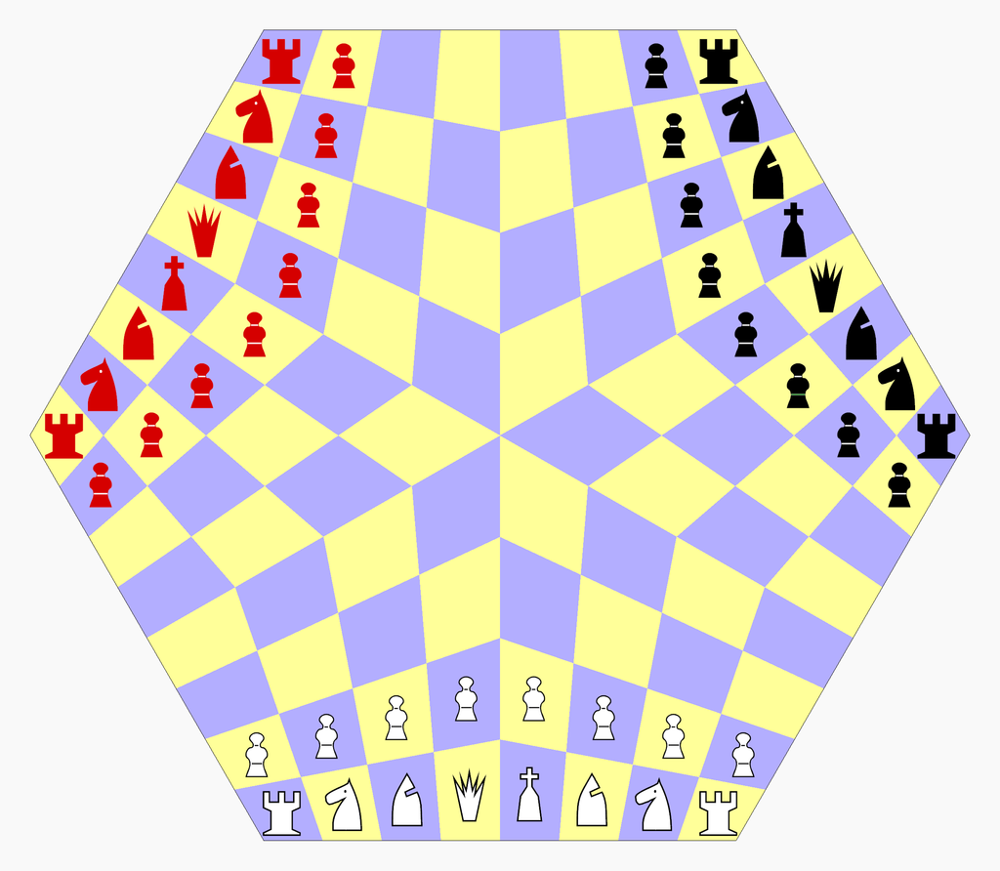
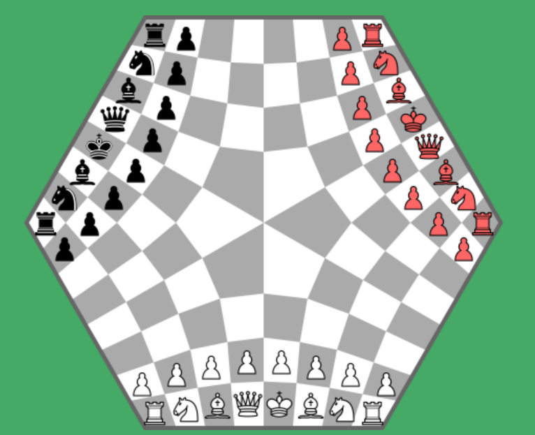
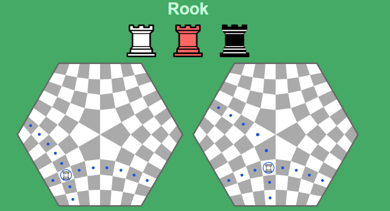
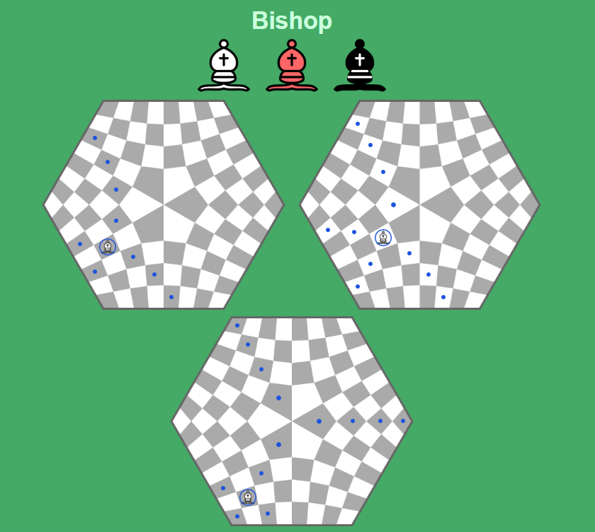
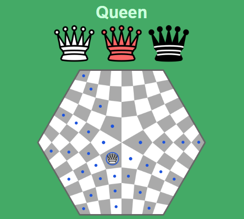
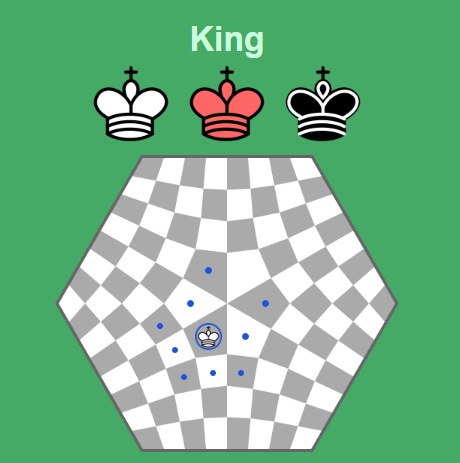
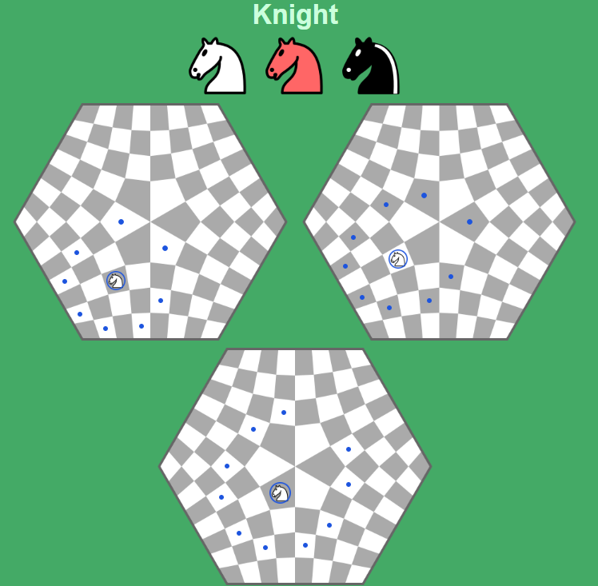
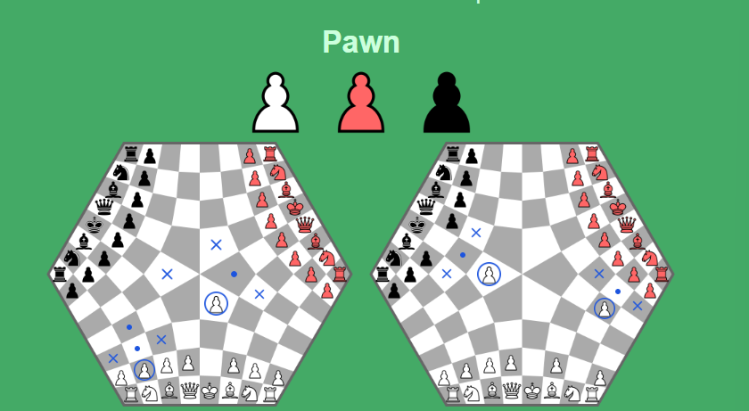

# 3-player-chess

This is an attempt to create a digital version of [this](https://en.wikipedia.org/wiki/Three-man_chess) chess game.

We've used C# and Unity to create this project. Considering our limited time frame we are focusing on completing the correct movements of the pawns and the king.

### Description of game 

There are three players in the game (White, Red and Black) and everyone is against everyone. The order that the players move in is White, Red, Black. The board is hexagonal which can be created by morphing three diffrent halves of a regular chess board together. The movement rules of the pieces are the same as in normal chess, however the "deformed" board makes for some exceptions (see below). The game ends when one of the players king is checkmated. The player that checkmates wins, the player that gets checkmated loses and the third player gets in second place.   

  

#### Movement of the pieces 

As stated the movements of the pieces look a little diffrent than in standard chess because of the board. At each third of the board (that is equivalent to half a standard chess board) the pieces move the same way as in regular chess. However the center of the board calls for special attention, since we have six corners of fields meeting (instead of four). Below are short descriptions of the pieces movements (as effected by the center).

##### Rock 

  

The Rock will always leave a field on the opposite side to where it entered. This means that the travel path will be bent at times (and not always be straight as in ordinary chess).

##### Bishop 

  

The Bishop will always leave a field from the opposite corner to where it entered. However there is also an additional requirment that it shall stay on the same field colour throughout the game. This means that when a bishop reaches the center it can continue moving in two alternative paths. 

##### Queen 

  

The Queens movements is like a combinition of the Rock and Bishop. 

##### King 

  

The King moves im the same way as the queen, though only one step at a time. (Castling works the same way as in standard chess.)

##### Knight 

  

The knight moves two steps in one orthogonal direction and then one step in the other or vice versa. On a normal chess board the order of these doesn't matter - you get the same eight possible moves either way. However, on this board the two sequences does not have the same effect around the center, which means that sometimes there are more than eight possibilities. The colour of the field that the knight arrives to will always be the opposite to the colour of the field it left. 

##### Pawn 

  

The pawn always moves from its own base, which means that it will move forward in a rook's manner. The pawn will capture opponents in the same direction as the bishop moves in. As usual the pawn moves one step at a time (except for the start where it can move two steps) and is tradeble for another piece when it reaches the base of another player. 
